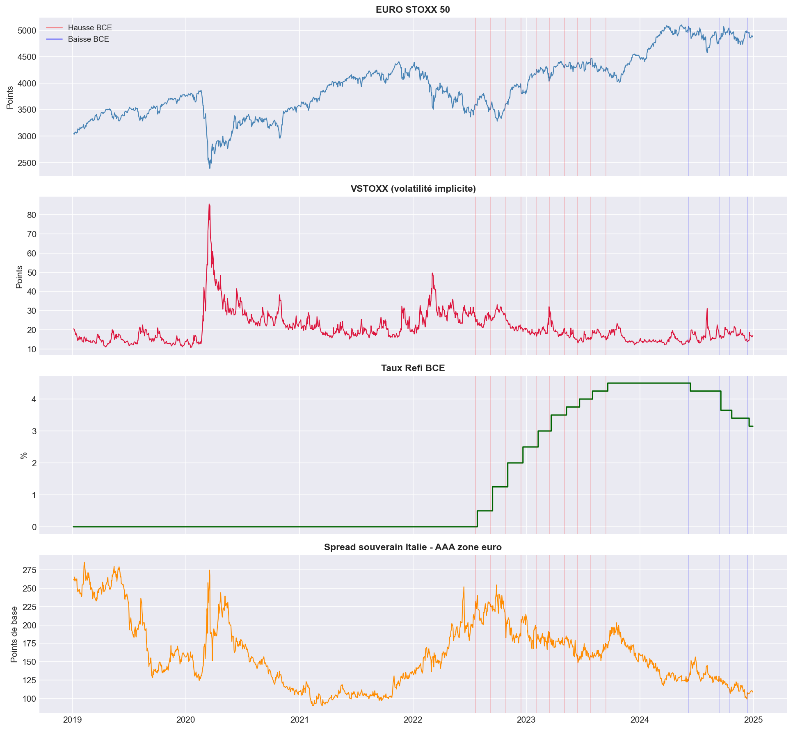
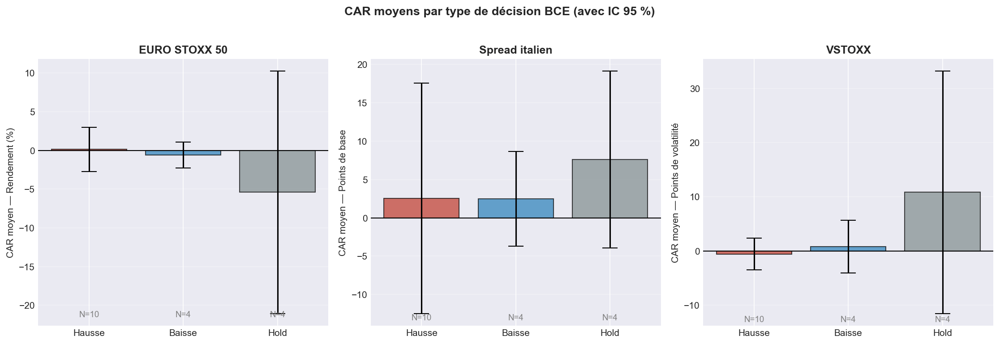
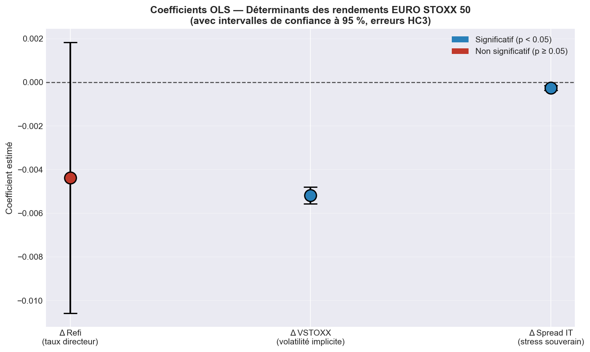
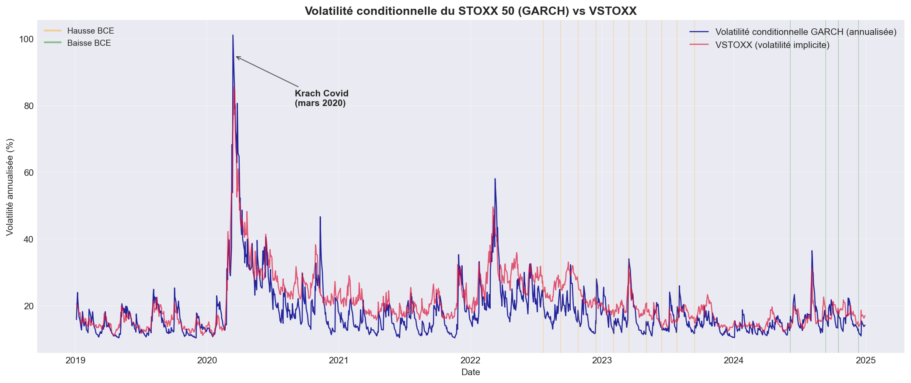

# Transmission de la politique monétaire de la BCE aux marchés financiers européens
 
> Analyse empirique de l'impact des décisions de politique monétaire de la Banque centrale européenne sur l'EURO STOXX 50, les spreads souverains et la volatilité implicite, sur la période 2019-2024.
 


-red)
 
---
 
##  Problématique
 
Les décisions de la BCE — hausses de taux, baisses, ou maintien — ont-elles un effet **directement mesurable** sur les marchés financiers européens ?
 
Ce projet teste cette question à travers **trois méthodologies indépendantes** : event study, régression OLS avec erreurs robustes, et modèle GARCH de volatilité conditionnelle. La convergence des trois approches fournit un résultat empirique robuste sur la transmission monétaire à la fréquence quotidienne.
 
##  Résultat principal
 
> **Les variations directes du taux directeur BCE n'ont pas d'effet significatif sur les rendements et la volatilité de l'EURO STOXX 50 à la fréquence quotidienne sur la période 2019-2024.** Ce résultat — cohérent avec l'hypothèse d'efficience des marchés — est confirmé par trois méthodologies indépendantes.
 
Les variables qui **expliquent significativement** les rendements quotidiens du STOXX 50 sont :
 
- **La volatilité implicite (VSTOXX)** — effet dominant, coefficient = −0.0052 (p < 0.001)
- **Le spread souverain italien** — effet significatif, coefficient = −0.00026 (p < 0.001)
Le taux directeur BCE, lui, n'apparaît dans aucune des analyses comme un déterminant direct des rendements quotidiens.
 
---
 
##  Données
 
| Variable | Source | Fréquence | Lignes |
|---|---|---|---|
| EURO STOXX 50 | Yahoo Finance (yfinance) | Quotidien | 1 510 |
| VSTOXX (volatilité implicite) | Investing.com | Quotidien | 1 536 |
| Taux AAA 10Y zone euro | ECB Data Portal (API) | Quotidien | 1 532 |
| Taux souverains 10Y (FR, IT, ES) | Investing.com | Quotidien | 1 532 |
| Taux Refi BCE | ECB Data Portal (API) | Calendaire | 2 192 |
| Décisions BCE 2019-2024 | Compilation manuelle | Événements | 18 |
 
**Période d'étude** : 1er janvier 2019 → 31 décembre 2024 (~1500 jours ouvrés)
 
La période couvre l'ensemble du cycle monétaire BCE récent : phase ultra-accommodante (taux négatifs jusqu'à mi-2022), cycle de hausses (+450 bp entre juillet 2022 et septembre 2023), puis amorce de l'assouplissement en 2024.
 
---
 
##  Méthodologie
 
Trois approches indépendantes sont mises en œuvre.
 
### 1. Event Study (Notebook 03)
 
Méthodologie classique inspirée de la littérature en finance empirique.
 
- Fenêtre d'estimation : [-30, -6] jours avant chaque décision
- Fenêtre d'événement : [-5, +5] jours autour de la décision
- Calcul des rendements anormaux (AR) et cumulés (CAR)
- Tests t à un échantillon sur les CAR
- Application à trois variables : rendements actions, spread italien, VSTOXX
### 2. Régression OLS (Notebook 04)
 
Approche complémentaire sur toute la période (1509 observations).
 
```
ret_sx5e_t = α + β₁·Δrefi_t + β₂·ΔVSTOXX_t + β₃·Δspread_IT_t + ε_t
```
 
- Estimation par moindres carrés ordinaires
- **Erreurs standard robustes HC3** (correction de l'hétéroscédasticité)
- Tests de diagnostic complets (normalité, hétéroscédasticité, autocorrélation)
### 3. Modèle GARCH(1,1) (Notebook 05)
 
Modélisation explicite de la dynamique de volatilité conditionnelle.
 
```
σ²_t = ω + α·ε²_{t-1} + β·σ²_{t-1}
```
 
- Estimation par maximum de vraisemblance
- Validation par tests sur résidus standardisés et résidus²
- Comparaison empirique volatilité réalisée / volatilité implicite (VSTOXX)
---
 
##  Résultats principaux
 
### Vue d'ensemble des données
 

 
Les quatre séries clés sur la période d'étude. Les lignes verticales matérialisent les décisions BCE (rouge pour les hausses, bleu pour les baisses). On observe visuellement que les pics de stress (STOXX 50, VSTOXX, spread italien) coïncident avec des chocs exogènes — Covid (mars 2020), Ukraine (mars 2022), crise énergétique (automne 2022) — **et non avec les décisions BCE**.
 
---
 
### Résultat 1 — Event Study : pas d'effet moyen significatif
 

 
Pour chaque variable et chaque type de décision (hausse, baisse, hold), les intervalles de confiance à 95 % **traversent systématiquement la ligne du zéro** : aucune réaction moyenne significative n'est détectée. Les tests t confirment ce constat avec des p-values toutes supérieures à 0.49.
 
| Variable | CAR moyen Hausses | p-value | CAR moyen Baisses | p-value |
|---|---|---|---|---|
| EURO STOXX 50 | +0.13 % | 0.93 | −0.59 % | 0.55 |
| Spread italien | +2.56 bp | 0.75 | +2.49 bp | 0.49 |
| VSTOXX | −0.61 pt | 0.69 | +0.79 pt | 0.77 |
 
---
 
### Résultat 2 — Régression OLS : la volatilité et le risque souverain dominent
 

 
| Variable | Coefficient | p-value | Significativité |
|---|---|---|---|
| Δ VSTOXX | −0.0052 | < 0.001 | *** |
| Δ Spread italien | −0.00026 | < 0.001 | *** |
| Δ Refi BCE | −0.0044 | 0.167 |  Non significatif |
 
**R² du modèle = 0.677** — les trois variables expliquent les deux tiers de la variance des rendements quotidiens. Le coefficient sur les variations du taux directeur BCE est négatif (signe attendu) mais **non significatif** au seuil de 5 %, confirmant le résultat de l'event study.
 
---
 
### Résultat 3 — GARCH(1,1) : la volatilité est dictée par les chocs exogènes
 

 
La volatilité conditionnelle estimée par le GARCH (bleu) suit fidèlement le VSTOXX (rouge), validant le calibrage du modèle. Les trois pics majeurs correspondent à des chocs **non monétaires** : Covid, Ukraine, crise énergétique. Les lignes verticales (décisions BCE) tombent quasi-systématiquement dans des zones de volatilité modérée.
 
**Paramètres GARCH(1,1) estimés** :
 
| Paramètre | Valeur | Interprétation |
|---|---|---|
| α | 0.178 | Sensibilité aux chocs récents |
| β | 0.770 | Persistance de la volatilité |
| α + β | **0.948** | Mémoire longue, environ 19 jours de demi-vie |
 
Tous les paramètres sont significatifs à p < 0.001. Les diagnostics confirment que le modèle **absorbe entièrement le clustering de volatilité** présent dans les résidus OLS du notebook 04.
 
---
 
### Synthèse : trois méthodes, une seule conclusion
 
| Méthode | Question posée | Verdict sur l'effet BCE |
|---|---|---|
| **Event Study** | Réaction dans la fenêtre [-5, +5] ? |  Aucun effet moyen significatif |
| **OLS + HC3** | Effet à la fréquence quotidienne ? |  Coefficient non significatif (p = 0.17) |
| **GARCH(1,1)** | Pic de volatilité aux dates BCE ? |  Aucun pic associé aux décisions |
 
**La convergence de trois méthodologies indépendantes vers la même conclusion** constitue le résultat principal et l'apport empirique du projet.
 
---
 
##  Limites et extensions possibles
 
### Limites identifiées
 
**1. Décisions brutes vs surprises monétaires**
 
La principale limite est conceptuelle : ce projet analyse la réaction aux **décisions** brutes de la BCE, alors que la théorie financière suggère que ce sont les **surprises** — l'écart entre la décision et l'anticipation de marché — qui devraient générer les réactions. Une décision pleinement anticipée est par construction déjà intégrée dans les prix avant l'annonce.
 
**2. Chocs exogènes concomitants**
 
L'event study ne peut pas distinguer la réaction à l'événement étudié des autres chocs simultanés. Le 12 mars 2020 illustre parfaitement cette limite : ce jour-là, ce n'est pas la BCE qui a fait bouger les marchés, mais le Covid-19.
 
**3. Fréquence quotidienne**
 
L'analyse porte sur la fréquence quotidienne. La politique monétaire peut se transmettre à des horizons plus longs (hebdomadaire, mensuel) via des canaux que cette fréquence ne capture pas (effets de bilan, refinancement bancaire, anticipations d'inflation).
 
**4. Hypothèse de normalité dans le GARCH**
 
Le modèle GARCH(1,1) suppose des innovations normales, alors que les résidus standardisés présentent une skewness négative (-0.67) et un excès de kurtosis (2.75). Une distribution de Student-t serait plus appropriée.
 
### Extensions possibles
 
- **Intégration des surprises monétaires** via les OIS 1 mois (Bloomberg)
- **Distinction hawkish vs dovish** dans le contenu des annonces (analyse textuelle des discours de Christine Lagarde)
- **Modèle GJR-GARCH ou EGARCH** pour capturer l'asymétrie des chocs (effet de levier)
- **Analyse en fréquence hebdomadaire / mensuelle** pour capter d'éventuels effets retardés
- **Décomposition du spread italien** entre composante risque-pays et composante liquidité
---
 
##  Stack technique
 
| Outil | Usage |
|---|---|
| **Python 3.12** | Langage principal |
| **Jupyter Notebook** | Environnement d'analyse |
| **pandas, numpy** | Manipulation des données |
| **matplotlib** | Visualisations |
| **yfinance** | Données EURO STOXX 50 |
| **requests** | Appels à l'API ECB Data Portal |
| **statsmodels** | Régression OLS, erreurs HC3, tests de diagnostic |
| **arch** | Modèle GARCH(1,1) |
| **scipy** | Tests statistiques (t-test, Jarque-Bera) |
| **python-dotenv** | Gestion sécurisée des clés API |
 
---
 
##  Structure du projet
 
```
ecb-monetary-policy-transmission/
├── data/
│   ├── raw/                          # Données brutes (source de vérité)
│   │   ├── sx5e.csv
│   │   ├── vstoxx_clean.csv
│   │   ├── aaa_10y.csv
│   │   ├── taux_souverains.csv
│   │   ├── refi.csv
│   │   ├── bce_events.csv
│   │   ├── france_10y.csv
│   │   ├── italy_10y.csv
│   │   └── spain_10y.csv
│   └── processed/                    # Données nettoyées
│       ├── data_clean.csv
│       └── bce_events.csv
├── notebooks/
│   ├── 01_data_collection.ipynb      # Collecte multi-sources
│   ├── 02_data_cleaning.ipynb        # Alignement et variables d'analyse
│   ├── 03_event_study.ipynb          # AR/CAR et tests de significativité
│   ├── 04_regression_ols.ipynb       # OLS + HC3 + diagnostics
│   └── 05_garch.ipynb                # GARCH(1,1) et volatilité conditionnelle
├── output/
│   ├── figures/                      # Graphiques exportés (PNG)
│   └── tables/                       # Tableaux exportés (CSV)
├── .env                              # Clés API (non versionné)
├── .gitignore
├── requirements.txt
└── README.md
```
 
---

##  Auteur
 
**ISLEYEN Volkan**
 
L3 Économie-Gestion, Université Grenoble Alpes 2023-2026
Erasmus à l'Université du Luxembourg 2025-2026
 
Profil orienté **finance de marché / quant**, candidat en Master en finance de marché et au L3 Ingénierie Financière de Dauphine.
 
📧 [volkanisleyen12@gmail.com]
🔗 [LinkedIn](linkedin.com/in/volkan-isleyen-60584038a)
 
---
 
##  Références méthodologiques
 
- **Bollerslev, T. (1986).** *Generalized Autoregressive Conditional Heteroskedasticity.* Journal of Econometrics, 31(3), 307-327.
- **MacKinlay, A. C. (1997).** *Event Studies in Economics and Finance.* Journal of Economic Literature, 35(1), 13-39.
- **White, H. (1980).** *A Heteroskedasticity-Consistent Covariance Matrix Estimator and a Direct Test for Heteroskedasticity.* Econometrica, 48(4), 817-838.
---
 
*Projet académique réalisé en mai 2026 dans le cadre d'une candidature en finance de marché. Toutes les données utilisées sont publiques ou accessibles gratuitement.*